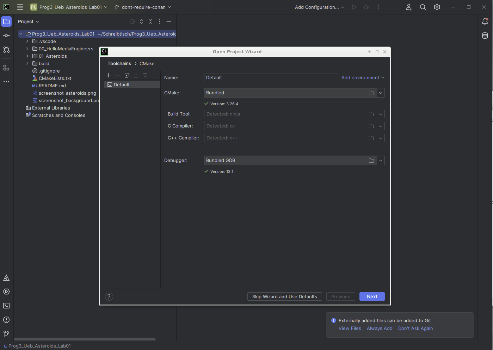

# PROG3 Lab 01

Autor: Prof. Dr.-Ing. Enrico Schröder - enrico.schroeder@th-nuernberg.de

**Willkommen zur ersten Übung zur Veranstaltung PROG3 / Teil B!**

# Übersicht

Im Laufe des Semesters werden Sie ein kleines Spiel in C++ schreiben (als Beispiel dient *Asteroids* - Sie können jedoch
auch ein anderes Spiel entwickeln) und dabei die wichtigsten Konzepte von Objektorientiertem Programmieren und C++
praktisch kennenlernen und anwenden.


Wir fangen jedoch langsam an. In diesem ersten Lab sollen Sie sich mit der Entwicklungsumgebung und den dazugehörigen
Tools vertraut machen. Sie werden ihr erstes simples C++ Programm schreiben und (manuell) kompilieren. Als nächstes
werden Sie mithilfe von [raylib](https://www.raylib.com) bzw. [raylib-cpp](https://github.com/RobLoach/raylib-cpp) Ihr erstes graphisches Programm in C++ schreiben,
welches Ihren Spiel-Hintergrund anzeigt. Am Ende werden Sie sich Gedanken machen, welche logische Architektur ihr Spiel
benötigt und diese als C++ Klassen implementieren.

Arbeiten Sie dieses Dokument bitte von oben nach unten komplett ab! Lesen Sie die einzelnen Abschnitte zuerst komplett
durch, bevor Sie loslegen!

## Abgaben

Um eine Übung erfolgreich zu bestehen, fertigen Sie ein Protokoll an und geben es (möglichst zeitnah) ab. In den
einzelnen Aufgaben ist genauer genannt, was ins Protokoll hinein muss. Generell sollen Sie jedoch folgendes
dokumentieren:

* Was haben Sie gelernt?
* Was hat funktioniert?
* Was hat nicht funktioniert?
* Was haben Sie probiert?

## Voraussetzungen und Setup der Entwicklungsumgebung

Die Übungen sind so konzipiert, dass sie prinzipiell auf jedem System bearbeitet werden können. Getestet wurde mit
*macOS* sowie *Ubuntu 22.04* und Windows 11. Sollten Sie eine ältere Ubuntu-Version als 22.04. haben, installieren Sie
bitte die aktuelle 22.04 (es wird die leichtgewichtige Ubuntu-Variante [Lubuntu](https://lubuntu.me) empfohlen).

In diesem ersten Schritt werden wir die benötigte Software und Tools installieren.

### Schritt 1 (CLion)

Als Entwicklungsumgebung kommt Jetbrains CLion zum Einsatz. Stellen Sie sicher, dass Sie CLion auf Ihrem
System installiert haben und ausführen können. Falls nicht, laden Sie die neuste Version hier
herunter: [CLion Download](https://www.jetbrains.com/de-de/clion/). Hinweis: CLion ist eine kommerzielle Software.
Nutzen Sie daher zuerst die 30-tägige Demoversion. Als Studierende an der TH Nürnberg bekommen Sie eine kostenlose
Studierendenlizenz, kümmern Sie sich darum aber außerhalb des Praktikums (melden Sie sich hier mit Ihrer TH-Mailadresse
an: https://www.jetbrains.com/shop/eform/students/).

### Schritt 2 (Compiler) - nur Ubuntu und macOS!

Wenn Sie Windows nutzen, überspringen Sie diesen Schritt (CLion bringt unter Windows einen passenden Compiler mit).

Sie benötigen einen C++ Compiler. Sie sollten aus andern Veranstaltungen üblicherweise bereits eine lauffähige
Installation haben. Testen Sie dies, indem Sie ein Terminal/Konsole öffnen und `g++` eintippen. Sie sollten eine
Ausgabe `Error: no input files` o.ä. sehen. In diesem Falle machen Sie mit Schritt 2 weiter!

Sehen sie etwas wie `Command not found: g++`, müssen Sie den Compiler erst noch installieren. Führen Sie folgenden
Befehl im Terminal aus:

* macOS: `xcode-select -install`
* Ubuntu: `sudo apt install build-essential`

Wiederholen Sie danach das Kommando `g++`, es sollte nun funktionieren!

### Schritt 3 (weitere Pakete) - nur Ubuntu!

Wenn Sie macOS oder Windows nutzen, überspringen Sie diesen Schritt!

Wir benötigen noch ein paar weitere Systempakete. Führen Sie im Terminal folgendes aus:
> sudo apt install libasound2-dev libx11-dev libxrandr-dev libxi-dev libgl1-mesa-dev libglu1-mesa-dev libxcursor-dev
> libxinerama-dev

**Glückwunsch, Ihr System ist nun bereit für das erste Programm!**

# Aufgabe 00

**Schreiben und kompilieren Sie ihr erstes C++ Programm, das einfach "Hello Media Engineers" auf der Konsole ausgibt.**

Öffnen Sie an dieser Stelle noch **nicht** CLion! Im Ordner `00_HelloMediaEngineers` finden Sie eine leere C++ Datei
*main.cpp*. Öffnen Sie diese mit einem Texteditor und implementieren Sie, analog zur Vorlesung,
ein simples C++ Programm, das "Hello Media Engineers" auf der Konsole ausgibt.

Kompilieren Sie dieses Programm **über das Terminal** und führen Sie es aus! Öffnen Sie dazu ein Terminal und navigieren
in den Ordner `00_HelloMediaEngineers`. Kompilieren Sie das Programm nun über den entsprechenden Kommandozeilenbefehl
und führen Sie es aus. Wenn Sie nicht wissen wie, schauen Sie ins Skript oder eine Suchmaschine! Notieren Sie die
benötigten Schritte im
Protokoll.

*Hinweis für Windows-Nutzer*: Falls Sie keinen Compiler auf Ihrem System installiert haben (und den integrierten
Compiler in CLion nutzen möchten), müssen Sie dessen Pfad in der Kommandozeile vor den Compilerbefehl setzen (da der
Compiler in diesem Fall nicht systemweit installiert ist und daher dem Terminal nicht bekannt ist). Der Pfad lautet in
der Regel "C:\Program Files\JetBrains\CLion 2023.2.2\bin\mingw\bin" (nutzen Sie auch die Anführungszeichen, ansonsten
kommt Windows nicht mit den Leerzeichen im Pfad klar...!).

# Aufgabe 01

**Schreiben und kompilieren Sie ein C++ Programm, welches ein grafisches Fenster öffnet und dort den Hintergrund Ihres
Spiels anzeigt.**

Wir verwenden [raylib](https://www.raylib.com) bzw. [raylib-cpp](https://github.com/RobLoach/raylib-cpp) für Grafikausgabe. Dies ist eine s.g. *Dependency 
(Abhängigkeit)*, d.h. ein externes Codemodul, welches wir in unser Projekt integrieren müssen. Vielleicht ist Ihnen das
aus anderen Sprachen wie z.B. *Java (packages)* oder *Python (modules)* bereits bekannt. Da C++ eine kompilierte Sprache
ist, gestaltet sich der Umgang mit externen Abhängigkeiten etwas komplizierter. Aber keine Angst, auch hier verwenden
wir ein Tool, das uns das Leben einfacher macht: Cmake. In Verbindung mit CLion und der inkludierten
Projektkonfiguration lädt Cmake
raylib herunter und integriert es in Ihr Projekt. Sie bekommen davon im ersten Schritt normalerweise nichts mit. Wir
werden aber später noch etwas mit der Cmake-Konfiguration in Kontakt kommen.

#### Aufgabe 01_a

Öffnen Sie nun CLion. Bestätigen Sie die Nutzerlizenz und wählen 'Start trial'. Sie sollten den Willkommensbildschirm
sehen. Klicke Sie auf 'Open' und wählen dort den Ordner `Prog3_Ueb_Asteroids_Lab01` (wo auch diese Datei liegt).
Es sollte sich der 'Open Project Wizard' öffnen:



Klicken Sie auf 'Next' und dann auf 'Finish'. Sie sollten nun in der oberen Symbolleiste ein paar Buttons vorfinden, so
wie hier:


Klicken Sie nun auf den kleinen Hammer ('Build'), um das leere Programm zu kompilieren. Nach einigen Sekunden sollten
Sie eine Ausgabe wie diese sehen:

```
...
[34/34] Linking CXX executable 01_Asteroids

Build finished
```

Glückwunsch, Sie haben nun Ihr erstes Programm mit CLion kompiliert. Sie können es mit dem Pfeil in der oberen
Symbolleiste starten. Allerdings werden Sie noch nicht viel sehen, da es aktuell noch leer ist. Sie werden es nun mit
etwas Leben füllen!

#### Aufgabe 01_b

Nutzen Sie raylib-cpp, um ein leeres Fenster mit dem Hintergrundbild Ihres Spiels anzuzeigen.

Im Ordner ```01_Asteroids``` finden Sie das Gerüst für ihr zukünftiges Spiel!

Finden Sie heraus, wie Sie ein Fenster öffnen und einen Hintergrund anzeigen. Schauen Sie dazu in die Dokumentation von
raylib-cpp: https://github.com/RobLoach/raylib-cpp.

Erweitern Sie die Datei ```01_Asteroids/src/main.cpp``` um die entsprechenden Funktionsaufrufe, sodass das Programm in
etwa so aussieht (im Ordner `01_Asteroids/resources` finden Sie ein paar Grafiken für Ihr Spiel):


Notieren Sie die wichtigsten Zeilen Ihres Programms im Protokoll!

Ein kleiner Hinweis zu raylib: Dies ist eigentlich eine C-Bibliothek. Wir verwenden aber die Sprache C++ und wollen
objektorientierten Code schreiben. Daher nutzen wir *raylib-cpp*, s.g. *C++ Bindings*. Diese machen die C Bibliothek nativ
aus C++ heraus nutzbar (mit Klassen und Vererbung und allem drum und dran). Die Dokumentation von raylib-cpp ist nicht
vollständig (da sie ja nur die Funktionen von raylib etwas "schöner" in C++ macht und man doppelte Dokumentation
unbedingt vermeiden will). Sie werden daher im Laufe der Übungen öfters die Dokumentation von der Standardversion von
raylib nutzen und selbständig die entsprechenden C++ Funktionsaufrufe herausfinden müssen (das ist aber meist sehr
einfach!).

# Aufgabe 02
**Machen Sie sich Gedanken über die Klassenstruktur Ihres Spiels und implementieren Sie Ihre erste Klasse.**

#### Aufgabe 02_a
Im Zentrum von objektorientierter Programmierung steht das *Objekt*, welches logisch zusammenhängende Daten, Zustände
und Funktionalität kapselt. Überlegen Sie, welche *Objekte* es in Ihrem Spiel geben könnte und was diese tun bzw. welche
Daten sie verwalten und in welcher Beziehung sie zueinander stehen. Sie können dies schon in C++ tun, können Ihre 
Antwort aber auch in Pseudocode oder Freitext formulieren. Auch muss die Klassenstruktur noch nicht vollständig sein 
(im Laufe der Übungen werden sich immer noch Erweiterungen und Änderungen ergeben)!

Notieren Sie ihre Antworten in Ihrem Protokoll!

#### Aufgabe 02_b
Implementieren Sie ein erstes Objekt, das *Spaceship*, als C++-Klasse mit dazugehörigen Daten und Methoden.
Schreiben Sie Ihre main.cpp Datei so um, dass dort eine Instanz des Objekts erstellt wird und Methoden
sinnvoll aufgerufen werden, um es im Spielefenster anzuzeigen.

Fügen Sie die wichtigsten Code-Schnipsel in ihr Protokoll hinzu!

#### Aufgabe 02_c (Bonusaufgabe)
Schaffen Sie es, zu implementieren, dass das Spaceship mittels Tastatureingaben steuerbar ist?

Fügen Sie die wichtigsten Code-Schnipsel in ihr Protokoll hinzu!
