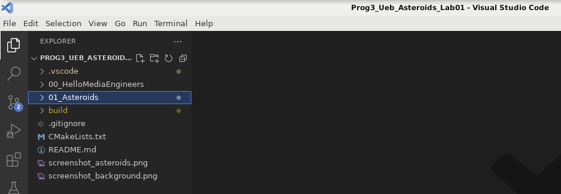
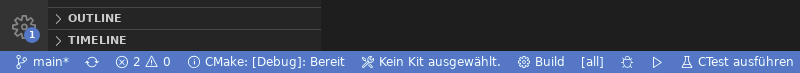
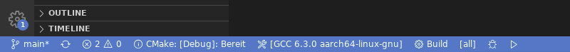

# PROG3 Lab 01
Autor: Prof. Dr.-Ing. Enrico Schröder - enrico.schroeder@th-nuernberg.de

**Willkommen zur ersten Übung zur Veranstaltung PROG3 / Teil B!**

# Übersicht
Im Laufe des Semesters werden Sie ein kleines Spiel in C++ schreiben (als Beispiel dient *Asteroids* - Sie können jedoch auch ein anderes Spiel entwickeln) und dabei die wichtigsten Konzepte von Objektorientiertem Programmieren und C++ praktisch kennenlernen und anwenden.


Wir fangen jedoch langsam an. In diesem ersten Lab sollen Sie sich mit der Entwicklungsumgebung und den dazugehörigen Tools vertraut machen. Sie werden ihr erstes simples C++ Programm schreiben und (manuell) kompilieren. Als nächstes werden Sie mithilfe von [raylib](https://www.raylib.com) bzw. [raylib-cpp](https://github.com/RobLoach/raylib-cpp) Ihr erstes graphisches Programm in C++ schreiben, welches Ihren Spiel-Hintergrund anzeigt. Am Ende werden Sie sich Gedanken machen, welche logische Architektur ihr Spiel benötigt und diese als C++ Klassen implementieren.

Arbeiten Sie dieses Dokument bitte von oben nach unten komplett ab!

## Abgaben
Um eine Übung erfolgreich zu bestehen, fertigen Sie ein Protokoll an und geben es (möglichst zeitnah) ab. In den einzelnen Aufgaben ist genauer genannt, was ins Protokoll hinein muss. Generell sollen Sie jedoch folgendes dokumentieren:
* Was haben Sie gelernt?
* Was hat funktioniert?
* Was hat nicht funktioniert?
* Was haben Sie probiert?

## Vorraussetzungen und Setup der Entwicklungsumgebung
Die Übungen sind so konzipiert, dass sie prinzipiell auf jedem System bearbeitet werden können. Es wird jedoch **wärmstens** empfohlen, Linux oder macOS zu verwenden. Nutzen Sie ggf. als Windows-Nutzer eine virtuelle Maschine. Diese Dokument enthält Anleitungen für *macOS* sowie *Ubuntu 22.04*.

In diesem ersten Schritt werden wir die benötigte Software und Tools installieren.

### Schritt 1 (Compiler)
Sie benötigen einen C++ Compiler. Sie sollten aus Vorgängerveranstaltungen (PROG2) üblicherweise bereits eine lauffähige Installation haben. Testen Sie dies, indem Sie ein Terminal/Konsole öffnen und `g++` eintippen. Sie sollten eine Ausgabe `Error: no input files` o.ä. sehen. In diesem Falle machen Sie mit Schritt 2 weiter!

Sehen sie etwas wie `Command not found: g++`, müssen Sie den Compiler erst noch installieren. Führen Sie folgenden Befehl im Terminal aus:
* macOS: `xcode-select -install`
* Ubuntu: `sudo apt install build-essentials`

Wiederholen Sie danach das Kommando `g++`, es sollte nun funktionieren!

### Schritt 2 (Cmake)
Wir benötigen außerdem [Cmake](https://cmake.org). Cmake hilft uns beim Kompilieren unseres Projekts und beim Verwalten der Abhängigkeiten (detaillierte Erklärung weiter unten).

Öffnen Sie wieder ein Terminal und führen `cmake --version` aus. Sie sollten die Ausgabe `cmake version 3.x.x` sehen. Die Version sollte größer oder gleich 3.11 sein. In diesem Falle machen Sie mit Schritt 3 weiter!

Sollten Sie `Command not found: cmake` sehen oder die Version kleiner als 3.11 sein, müssen Sie Cmake erst noch installieren bzw. updaten.

#### macOS
Laden Sie hier eine aktuelle Version herunter: [Cmake 3.27.7 macOS](https://github.com/Kitware/CMake/releases/download/v3.27.7/cmake-3.27.7-macos10.10-universal.dmg). Installieren Sie sie wie jede gewöhnliche macOS Applikation.

Nun führen Sie im Terminal folgendes Kommando aus: `sudo "/Applications/CMake.app/Contents/bin/cmake-gui" --install=/usr/local/bin`. Wiederholen Sie nun `cmake --version`, es sollte die entsprechende Version angezeigt werden.

#### Ubuntu
1) Falls Sie cmake nicht installiert haben (`Command not found: cmake`): Installieren Sie es mit folgendem Kommando: `sudo apt install cmake`. Prüfen Sie nun die Version (`cmake --version`). Falls die Version nun passt, gehen Sie zu Schritt 3! Ansonsten:

2. 
    1. Falls Sie eine zu alte Version haben, deinstallieren Sie sie. Führen Sie im Terminal folgendes aus: `sudo apt uninstall cmake`. 
    2. Laden Sie nun hier eine aktuelle Version herunter: [Cmake 3.27.7 Linux](https://github.com/Kitware/CMake/releases/download/v3.27.7/cmake-3.27.7-linux-x86_64.sh). Navigieren Sie im Terminal in den Ordner, wo Sie die Datei gespeichert haben (überlicherweise 'Downloads'): `cd ~/Downloads`. Führen Sie nun folgendes Kommando aus: `sudo sh cmake-3.27.7-linux-x86_x64.sh --prefix=/usr/local --skip-license --exclude-subdir`.
    3. Prüfen Sie nun die Version (`cmake --version`). Es sollte die neue Version angezeigt werden.

### Schritt 3 (nur Ubuntu!)
Wir benötigen noch ein paar weitere Systempakete. Führen Sie im Terminal folgendes aus:
> sudo apt install libasound2-dev libx11-dev libxrandr-dev libxi-dev libgl1-mesa-dev libglu1-mesa-dev libxcursor-dev libxinerama-dev

### Schritt 4 (Vscode)
Als Entwicklungsumgebung kommt Visual Studio Code (vscode) zum Einsatz. Stellen Sie sicher, dass Sie vscode auf Ihrem System installiert haben und ausführen können. Falls nicht, laden Sie die die neuste Version hier herunter: [Vscode Download](https://code.visualstudio.com/Download).

Öffnen Sie vscode und installieren das [C/C++ Extension Pack](https://marketplace.visualstudio.com/items?itemName=ms-vscode.cpptools-extension-pack).

**Glückwunsch, Ihr System ist nun bereit für das erste Programm!**

# Aufgabe 00
Schreiben und kompilieren Sie ihr erstes C++ Programm, das einfach "Hello Media Engineers" auf der Konsole ausgibt.

Im Ordner `00_HelloMediaEngineers` finden Sie eine leere C++ Datei *main.cpp*. Implementieren Sie, analog zur Vorlesung, ein simples Programm, das "Hello Media Engineers" auf der Konsole ausgibt.

Kompilieren Sie dieses Programm **über die Konsole** und führen Sie es aus! Notieren Sie die benötigten Schritte im Protokoll.

Hinweis: Sie können natürlich schon in diesem Schritt vscode als Editor verwenden. Kompilieren Sie es aber bitte nicht mit dem "Play" Knopf, sondern über die Konsole (Sie können in vscode über "Terminal->New Terminal" eine in Ihrem Projekt öffnen).

# Aufgabe 01
Schreiben und kompilieren Sie ein C++ Programm, welches ein graphisches Fenster öffnet und dort den Hintergrund Ihres Spiels anzeigt.

Hierfür sind ein paar weitere Schritte nötig. Wir verwenden [raylib](https://www.raylib.com) bzw. [raylib-cpp](https://github.com/RobLoach/raylib-cpp) für Grafikausgabe. Dies ist eine s.g. *Dependency (Abhängigkeit)*, d.h. ein externes Codemodul, welches wir in unser Projekt integrieren müssen. Vielleicht ist Ihnen das aus anderen Sprachen wie z.B. *Java (packages)* oder *Python (modules)* bereits bekannt. Da C++ eine kompilierte Sprache ist, gestaltet sich der Umgang mit externen Abhängigkeiten etwas komplizierter. Aber keine Angst, auch hier verwenden wir ein Tool, das uns das Leben einfacher macht: [Cmake](https://cmake.org). Wenn alles richtig funktioniert, lädt Cmake raylib herunter und integriert es in Ihr Projekt.

#### Aufgabe 01_a
Öffnen Sie den Ordner `Prog3_Ueb_Asteroids_Lab01` (wo auch diese Datei liegt) in vscode mittels 'File->Open Folder'. Damit die nächsten Schritte funktionieren, ist es wichtig, dass Sie das Projekt als Ordner in vscode geöffnet haben, nicht nur einzelne Dateien. Sie sollten in der linken Toolbar den Ordner mit allen seinen Dateien sehen:


Schauen Sie sich die untere Toolbar von vscode an. Sie sollte in etwa so aussehen:


Klicken Sie auf 'Kein Kit ausgewählt' und wählen im Menü dann einen Compiler (z.B. *gcc...* oder *clang*). 

Nun sollte das Ganze in etwa so aussehen:



Klicken Sie nun auf 'Build', um das leere Programm zu kompilieren. Sie sollten nun eine ähnliche Ausgabe wie diese sehen:
```
[proc] Befehl wird ausgeführt: /usr/local/bin/cmake --build /home/eschroeder/Schreibtisch/Prog3_Ueb_Asteroids_Lab01/build/Debug --config Debug --target all -j 4 --
[build] [ 70%] Built target glfw
[build] [ 94%] Built target raylib
[build] [100%] Built target 01_Asteroids
[driver] Build abgeschlossen: 00:00:00.037
[build] Der Build wurde mit dem Exitcode 0 abgeschlossen.
```

Glückwunsch, Sie haben nun Ihr erstes Programm mit Cmake kompiliert. Sie können es mit dem kleinen Pfeil in der unteren Symbolleiste starten. Allerdings werden Sie noch nicht viel sehen, da es aktuell noch leer ist. Sie werden es nun mit etwas Leben füllen!

#### Aufgabe 01_b
Im Ordner ```01_Asteroids``` finden Sie das Gerüst für ihr zukünftiges Spiel! 

Nutzen Sie raylib-cpp, um ein leeres Fenster mit dem Hintergrundbild Ihres Spiels anzuzeigen. Finden Sie heraus, wie das geht, indem Sie die Dokumentation von raylib-cpp konsultieren: https://github.com/RobLoach/raylib-cpp

Erweitern Sie die Datei ```01_Asteroids/src/main.cpp``` um die entsprechenden Funktionsaufrufe, sodass das Programm in etwa so aussieht:


Notieren Sie die wichtigsten Zeilen Ihres Programms im Protokoll!

Ein kleiner Hinweis zu raylib: Dies ist eigentlich eine C-Bibliothek. Wir verwenden aber die Sprache C++ und wollen objektorierten Code schreiben. Daher nutzen wir *raylib-cpp*, s.g. *C++ Bindings*. Diese machen die C Bibliothek nativ aus C++ heraus nutzbar (mit Klassen und Vererbung und allem drum und dran). Die Dokumentation von raylib-cpp ist nicht vollständig (da sie ja nur die Funktionen von raylib etwas "schöner" in C++ macht und man doppelte Dokumentation unbedingt vermeiden will). Sie werden daher im Laufe der Übungen öfters die Dokumentation von der Standardversion von raylib nutzen und selbständig die entsprechenden C++ Funktionsaufrufe herausfinden müssen (das ist aber meist sehr einfach!). 

# Aufgabe 02
Im Zentrum von objektorientierter Programmierung steht das *Objekt*, welches logisch zusammenhängende Daten, Zustände und Funktionalität kapselt. Überlegen Sie, welche *Objekte* es in Ihrem Spiel geben könnte und was diese tun bzw. welche Daten sie verwalten und in welcher Beziehung sie zueinander stehen. Dies muss noch nicht vollständig sein (im Laufe der Übungen werden sich immer noch Erweiterungen und Änderungen ergeben)!

Notieren Sie ihre Antworten in Ihrem Protokoll!

Implementieren Sie ein oder zwei der wichtigsten Objekte als C++-Klassen mit dazugehörigen Daten und Methoden. Schreiben Sie Ihre main.cpp Datei so um, dass dort Instanzen des/der Objekt(e) erstellt werden und ggf. Methoden sinnvoll aufgerufen werden, um sie z.B. im Spielefenster anzuzeigen. 

Fügen Sie die wichtigsten Code-Schnipsel in ihr Protokoll hinzu!